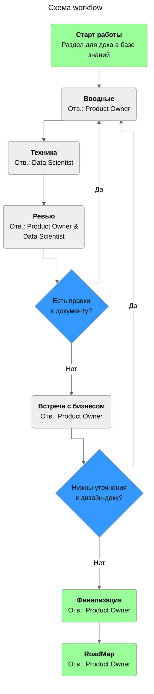

# ML System Design Doc  
## Рекомендации по процессу заполнения документа

Заполнение документа происходит **итерационно**:   

- **Старт работы**. Создаем раздел продукта в базе знаний.  
- **Вводные**. `Product Owner` заполняет все имеющиеся **вводные**. На новых итерациях - вносит уточнения по новой информации от бизнеса.    
- **Техника**. `Data Scientist`, ответственный за продукт, заполняет остальное. Все вопросы, которые возникают у `Data Scientist` к бизнесу в процессе заполнения дока, пишем прям в документе и отмечаем отдельным цветом (например, желтым). Этим же цветом отмечаем важные моменты, которые нужно согласовать с бизнесом (формулы расчета ключевых метрик/переменных, формат итогового отчета, и т.п.).      
- **Ревью**. Версия дизайн-дока проходит ревью по процессу, принятому в команде. Технические вопросы к доку от ревьюеров помечаются отдельным цветом (например, красным). При необходимости внесения технических правок до показа версии документа бизнесу возвращаемся к пункту 3.  
- **Встреча с бизнесом**. Организуется встреча с бизнес-заказчиком для получения ответов на вопросы, уточнения неясных моментов в дизайн-доке и согласования ключевых моментов. То есть, по всем моментам, отмеченным в нашем примере желтым цветом. Все, что согласовано всеми сторонами, перестает быть выделено цветом. По итогам ответов бизнеса возвращаемся к пункту 2, или - если все согласовано - переходим к этапу 7.     
- **Финализация**. Если по итогам встречи с бизнесом, все ключевые моменты согласованы, то версию документа считаем финальной.   
- **RoadMap**. Составляем дорожную карту работы над итерацией по итогам финальной версии документа. Реалистичная и структурная дорожная карты работы над ML-решением - это один из ключевых результатов работы над ML System Design Doc. 

